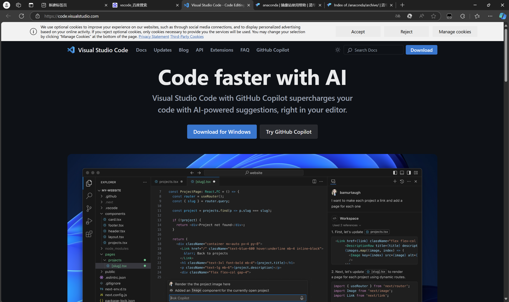
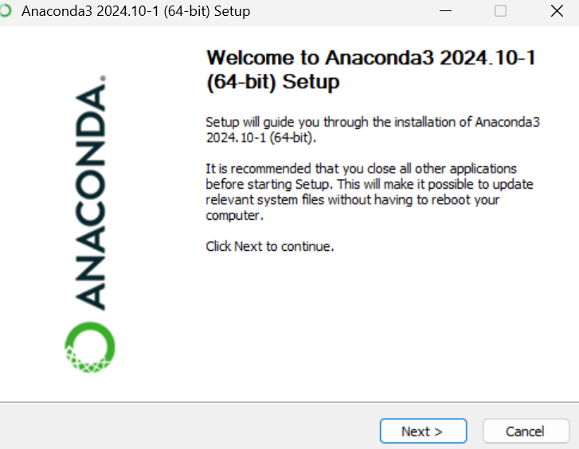
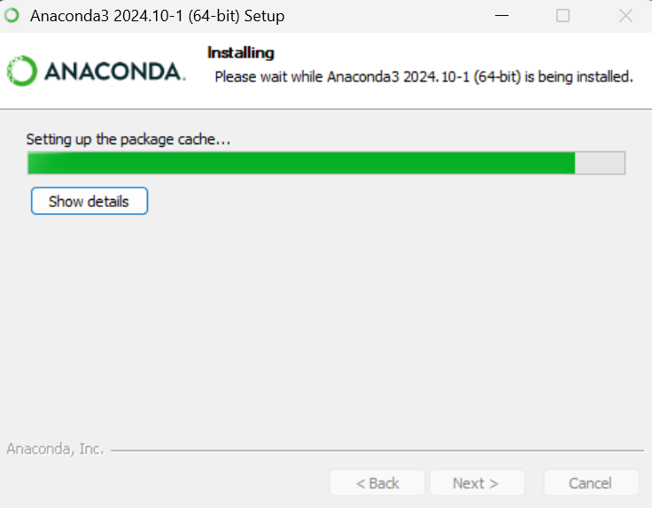
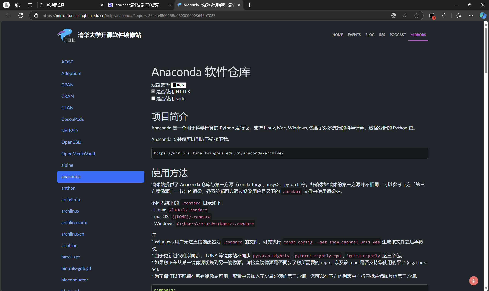
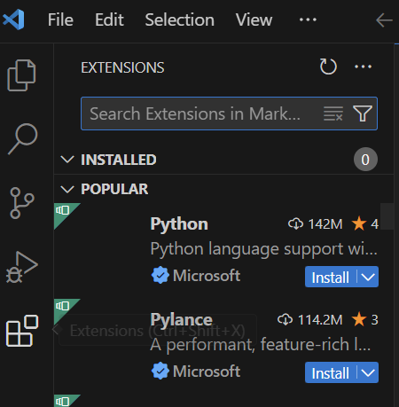
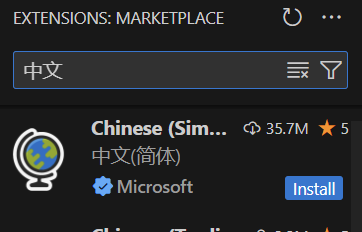
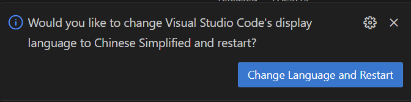

1.anaconda安装
百度搜索anaconda清华镜像或打开网址（https://www.anaconda.com/products/distribution）

在界面中根据提示下载
找到属于自己电脑版本的文件
下载后打开安装包文件点击next，按需选择选项完成安装

点击下方搜索栏或windows+S搜索anaconda powershell prompt

打开后依次输入
python
检查python版本号
   conda env list
检查当前环境列表
   conda create --name 环境名称 python=版本号
系统会列出将要安装的包，输入 'y' 并回车确认

2.vscode安装
百度搜索vscode或搜索网址（https://code.visualstudio.com/）

点击下载，完成后选择安装包文件，按需选择选项完成安装
打开后点击左侧工具栏最下面拓展图标

搜索“中文”，找到并下载

点击重启并切换语言

